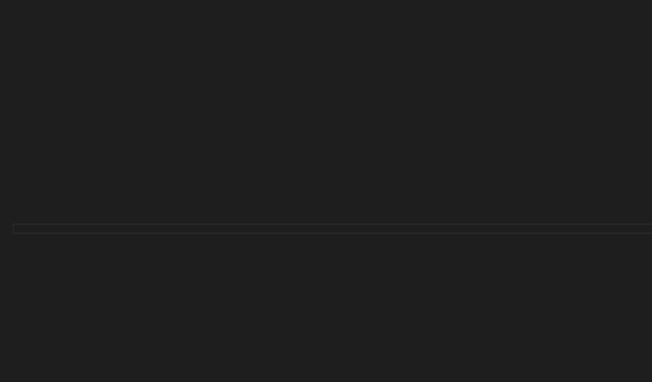

# cfx-natives-mapper

Install modules with `yarn`

Run mapping with `node index.js`

You can then place the `[_docs]` into your resources folder and use a plugin like EmmyLua for VSCode to auto complete

